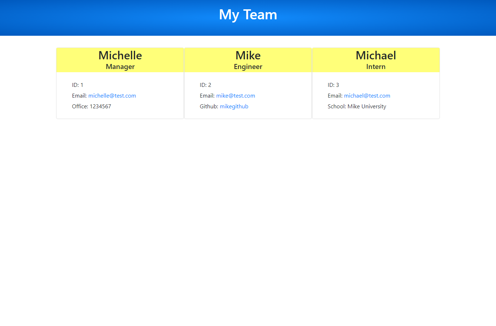

# Team Profile Generator

 ## Description
  
  This application will generate a team profile by prompting its user with questions and using the inputted data to generate an HTML page with a card for each team member.
  
  ## Table of Contents 
  
  - [Installation](#installation)
  - [Usage](#usage)
  - [License](#license)
  - [Contributions](#contributions)
  - [Tests](#tests)
  - [Questions](#questions)
  
  
  ## Installation
  To install, follow the below instructions:
  - Download Node.js
  - Clone git repo to your local environment

  ## Usage
  Instructions for use
  - Open file in integrated terminal
  - Run 'npm i' (this command will install Inquirer and Jest)
  - Run 'npm start' and answer all questions to build team profile
  - Once user is finished adding team members, an HTML file should be created under 'dist/generated-html' folder.

  Github repo: https://github.com/michelletrn/teamprofile-gen

  Here is a screen shot of a generated team profile page:
  

  Demo video link (also found in asssets folder): https://drive.google.com/file/d/19n6pigVj987CqOMJbJ2Qh8hqZc4mxx9f/view
 
  ## License
  MIT
  
  ## Contributions
  Contributors: Michelle Tran
  
  ## Features
  
  N/A

  ## Tests

  Run 'npm test' to run tests with Jest
    
  ## Questions
  If you have any questions, please contact:
  
  Github: Michelletrn